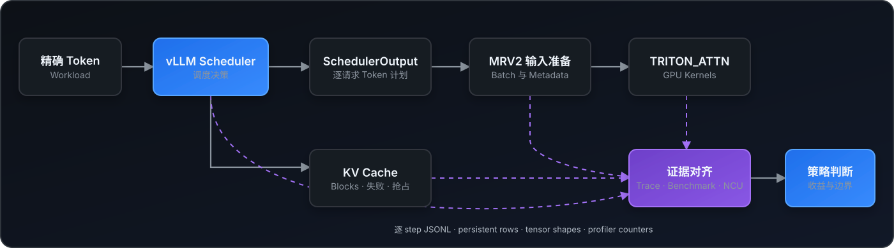

# vLLM Scheduler Trace Lab（调度追踪实验）

一个基于证据的 vLLM v0.26 调度研究项目，覆盖 KV Cache 压力、MRV2 输入准备
以及 RTX 2060 Laptop 6 GiB GPU 上的执行行为。

项目从逐 step 可观测性出发，定位真实的 waiting 队列队头阻塞
（head-of-line blocking，HOL），实现可选的 bypass 策略，再通过反例否决不安全的
上游提交方案。最终结果不是一个只有漂亮数字的“加速”，而是一套包含正向收益、
退化场景和明确证据边界的可复现系统实验。

> 源码实现位于 [`Xiaoda11/vllm` 的
> `exp/mrv2-scheduler-trace` 分支](https://github.com/Xiaoda11/vllm/tree/exp/mrv2-scheduler-trace)，
> 精确提交为 [`b27c09dd873de6fff45dc995138becf03288a92f`](https://github.com/Xiaoda11/vllm/commit/b27c09dd873de6fff45dc995138becf03288a92f)。

## 研究链路

Trace 默认关闭。开启后，它只记录 Scheduler 状态和已有的 CPU metadata，不读取
GPU tensor、不调用 `.item()`，也不增加 CUDA synchronize。

## 问题是什么

在 full-input reservation 和受限的 1,450-block KV pool 下，长请求 B 位于 FCFS
队首，约需 1,024 blocks，但当时只有 933 blocks 空闲。排在 B 后面的短请求 C
只需约 64 blocks，本可以被容纳；strict Scheduler 却在 B allocation failure 后
停止扫描，导致 C 也等待了约 33 秒。

实验策略允许暂时跳过被阻塞的队首请求，准入后续可容纳请求。bounded 版本进一步
规定每个 blocked head 最多允许一次 bypass admission。两种模式都需要显式开启，
默认 Scheduler 行为保持不变。

## 改变最终判断的实验结果

| 实验 | 结果 | 说明 |
|---|---:|---|
| 三请求重复 Gate | C TTFT median：**33.250 s → 0.182 s** | HOL 问题和局部收益真实存在 |
| 无界短请求 burst | B first scheduled step：**517 → 587**；B TTFT **+10.0%** | 逐 step 重试不是 starvation bound |
| bounded 长生命周期 burst | **新增 3 次 preemption**，makespan **+1.21%**，throughput **-1.20%**，TTFT Jain **-10.64%** | admission count 无法限制 KV 生命周期 |
| Scheduler 对齐 profile | strict：**20 个 single Decode**；bounded：**17 个 single + 1 个 mixed + 2 个 dual Decode** | 策略改变 batch shape 与 kernel 组合，而非 kernel 代码 |

最终结论是：**不提交 upstream PR**。one-admission bound 只能限制绕过队首的请求
数量，不能限制准入请求持有 KV Cache 的时间。因此即使 B 的首次调度 step 不变，
长生命周期请求仍可能造成后续 preemption 和公平性退化。

## GPU 侧证据

当前 WSL 路径下的 Nsight Systems 能看到 CUDA API，但没有可靠的 GPU kernel
timeline。项目使用与 Scheduler 对齐的 PyTorch Profiler fallback，将 step 60–79
对应到真实 CUDA 工作，并观察到一个由 1 个 Decode token 和 1,024 个 Prefill
tokens 组成的 bounded mixed step。

针对一个真实 Prefill GEMM 的 Nsight Compute 采集结果如下：

| 指标 | 数值 |
|---|---:|
| Achieved occupancy | 24.67% |
| L2 hit rate | 84.01% |
| SM throughput | 41.68% |
| DRAM throughput | 25.84% |
| `math_pipe_throttle` stall | 61.85% |
| `long_scoreboard` stall | 1.41% |

这个 launch 不呈现简单的 DRAM-latency-bound 特征。但它的 grid 尚未与 mixed
Scheduler step 唯一对齐，因此这些 counter 只作为 targeted microarchitecture
证据，不用于端到端策略性能归因。

## 项目实现

- 默认关闭的 Scheduler 与 MRV2 JSONL trace；
- 支持精确 token、arrival time 和 shared prefix 的 workload generator；
- trace-to-CSV、benchmark aggregate 与 profiler alignment 分析器；
- 可选的无界与 one-admission waiting bypass；
- Scheduler、workload、trace 和 analyzer 的针对性测试；
- 覆盖 8K/16K Prefill、Prefill/Decode 混合、Prefix Cache 复用、allocation
  failure、preemption 和请求生命周期反例的受控 workload。

## 阅读与复现

| 目标 | 入口 |
|---|---|
| 从零复现实验 | [REPRODUCING.md](REPRODUCING.md) |
| 理解 Trace 数据流与埋点 | [docs/trace_design.md](docs/trace_design.md) |
| 核对验证证据与适用边界 | [docs/validation.md](docs/validation.md) |
| 对照 Scheduler 与 MRV2 精简样例 | [examples/README.md](examples/README.md) |
| 阅读中文工程报告 | [docs/report_zh.md](docs/report_zh.md) |
| 查看可机器读取的 benchmark 结果 | [results/benchmark_summary.json](results/benchmark_summary.json) |
| 查看 profiling 结果及证据边界 | [results/profile_summary.json](results/profile_summary.json) |
| 阅读源码分支中的完整工程报告 | [完整报告](https://github.com/Xiaoda11/vllm/blob/exp/mrv2-scheduler-trace/docs/scheduler_trace_lab_final_report.md) |
| 执行完整复现矩阵 | [复现指南](https://github.com/Xiaoda11/vllm/blob/exp/mrv2-scheduler-trace/benchmarks/scheduler_trace/README.md) |
| 查看实现、测试与代码地图 | [源码项目概览](https://github.com/Xiaoda11/vllm/blob/exp/mrv2-scheduler-trace/docs/scheduler_trace_lab_project_overview.md) |

源码复现指南保留了精确命令、scenario configs、分析器和测试入口。模型、虚拟
环境、原始 profiler 报告和大体积运行目录不会复制到这个展示仓库。

## 复现与结论边界

实验固定使用 vLLM v0.26.0、MRV2、`TRITON_ATTN`、
Qwen2.5-0.5B-Instruct FP16、WSL2 和 RTX 2060 Laptop GPU。结论不能直接外推到
多 GPU serving、大模型、其他 attention backend 或 CUDA Graph 模式。

稳定的策略判断来自无 profiler 的重复 benchmark；单次 profiler 与 NCU capture
只用于解释执行结构。
