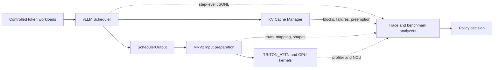

# vLLM Scheduler Trace Lab

An evidence-driven study of vLLM v0.26 scheduling, KV-cache pressure, MRV2
input preparation, and GPU execution on a 6 GiB RTX 2060 Laptop GPU.

The project starts with step-level observability, finds a real waiting-queue
head-of-line (HOL) blocking case, implements an opt-in bypass policy, and then
uses counterexamples to reject the policy for upstream submission. The result
is not a headline-only speedup: it is a reproducible systems investigation with
positive results, regressions, and explicit evidence boundaries.

> Source implementation: [`Xiaoda11/vllm`, branch
> `exp/mrv2-scheduler-trace`](https://github.com/Xiaoda11/vllm/tree/exp/mrv2-scheduler-trace)
> at commit [`b27c09dd873de6fff45dc995138becf03288a92f`](https://github.com/Xiaoda11/vllm/commit/b27c09dd873de6fff45dc995138becf03288a92f).

## System under study

The trace is disabled by default. When enabled, it records Scheduler state and
existing CPU metadata without reading GPU tensors, calling `.item()`, or adding
CUDA synchronization.

## The problem

Under full-input reservation and a constrained 1,450-block KV pool, request B
was at the FCFS queue head and needed about 1,024 blocks while only 933 were
free. Request C, queued behind B, needed about 64 blocks and could have fit.
The strict scheduler stopped scanning after B's allocation failure, so C waited
roughly 33 seconds too.

The experimental policy allows a blocked head to be skipped and admits a later
request. A bounded version permits at most one such admission for each blocked
head. Both modes are opt-in; the default scheduler behavior is unchanged.

## Results that changed the decision

| Experiment | Result | What it proves |
|---|---:|---|
| Repeated three-request gate | C TTFT median: **33.250 s → 0.182 s** | The HOL problem and local benefit are real |
| Unbounded short-request burst | B first scheduled step: **517 → 587**; B TTFT **+10.0%** | Per-step retry is not a starvation bound |
| Bounded long-lived burst | **3 new preemptions**, makespan **+1.21%**, throughput **-1.20%**, TTFT Jain **-10.64%** | Admission count does not bound KV lifetime |
| Scheduler-aligned profile | strict: **20 single Decode**; bounded: **17 single + 1 mixed + 2 dual Decode** | The policy changes batch shape and kernel mix, not kernel code |

The final decision is **no upstream PR**. One-admission bounding limits how many
requests bypass a blocked head, but not how long the admitted request occupies
KV cache. A longer-lived request can therefore create later preemption and
fairness regressions even when B's first scheduled step is unchanged.

## GPU evidence

Nsight Systems on this WSL path exposed CUDA API activity but no reliable GPU
kernel timeline. A scheduler-aligned PyTorch Profiler fallback associated steps
60–79 with real CUDA work and found a bounded mixed step containing one Decode
token plus a 1,024-token Prefill.

A targeted Nsight Compute capture of a real Prefill GEMM reported:

| Metric | Value |
|---|---:|
| Achieved occupancy | 24.67% |
| L2 hit rate | 84.01% |
| SM throughput | 41.68% |
| DRAM throughput | 25.84% |
| `math_pipe_throttle` stall | 61.85% |
| `long_scoreboard` stall | 1.41% |

This launch does not look like a simple DRAM-latency-bound kernel. Its grid was
not uniquely aligned with the mixed Scheduler step, so the counters are treated
as targeted microarchitectural evidence—not as end-to-end policy attribution.

## What was built

- Opt-in Scheduler and MRV2 JSONL traces.
- Exact-token workload generator with controlled arrivals and shared prefixes.
- Trace-to-CSV, benchmark aggregation, and profiler-alignment analyzers.
- Opt-in unbounded and one-admission waiting bypass variants.
- Focused Scheduler, workload, trace, and analyzer tests.
- Workloads covering 8K/16K Prefill, mixed Prefill/Decode, prefix-cache reuse,
  allocation failure, preemption, and request-lifetime counterexamples.

## Read and reproduce

| Goal | Link |
|---|---|
| Read the concise Chinese engineering report | [docs/report_zh.md](docs/report_zh.md) |
| Inspect machine-readable benchmark results | [results/benchmark_summary.json](results/benchmark_summary.json) |
| Inspect profiling results and boundaries | [results/profile_summary.json](results/profile_summary.json) |
| Read the full report in the source fork | [full engineering report](https://github.com/Xiaoda11/vllm/blob/exp/mrv2-scheduler-trace/docs/scheduler_trace_lab_final_report.md) |
| Follow the complete reproduction matrix | [source reproduction guide](https://github.com/Xiaoda11/vllm/blob/exp/mrv2-scheduler-trace/benchmarks/scheduler_trace/README.md) |
| Inspect the implementation and tests | [source project overview](https://github.com/Xiaoda11/vllm/blob/exp/mrv2-scheduler-trace/docs/scheduler_trace_lab_project_overview.md) |

The source guide records exact commands, scenario configs, analyzers, and test
entry points. Models, virtual environments, raw profiler reports, and large run
directories are intentionally excluded from this showcase repository.

## Reproduction boundary

The measurements use vLLM v0.26.0, MRV2, `TRITON_ATTN`, Qwen2.5-0.5B-Instruct
FP16, WSL2, and an RTX 2060 Laptop GPU. They do not establish behavior for
multi-GPU serving, larger models, other attention backends, or CUDA Graph mode.
Stable policy conclusions come from unprofiled repeated benchmarks; one-off
profiler and NCU captures are used only to explain execution structure.
