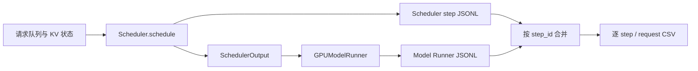

# Trace 设计与实现

这个 Trace 的目标不是记录“某个请求很慢”，而是回答慢在哪个调度步骤发生、Scheduler 做了什么决定，以及该决定最终如何变成 Model Runner 的输入。

## 数据流



## Scheduler 侧

主要实现位于 [`trace.py`](https://github.com/Xiaoda11/vllm/blob/exp/mrv2-scheduler-trace/vllm/v1/core/sched/trace.py) 和 [`scheduler.py`](https://github.com/Xiaoda11/vllm/blob/exp/mrv2-scheduler-trace/vllm/v1/core/sched/scheduler.py)。每个调度步骤记录：

- 调度前后的 running、waiting、skipped 队列；
- 请求状态、prompt/output token 数、computed/in-flight/processed token 数；
- 本步每个请求获得的 token 数；
- KV cache 使用率、空闲块数和 block table 差分；
- waiting/running 阶段的分配失败、抢占、完成等事件。

block table 的增加表示请求视角的映射发生变化；启用 prefix cache 时，它不必然等价于新申请了同样数量的物理块。

## Model Runner 侧

埋点位于 [`model_runner.py`](https://github.com/Xiaoda11/vllm/blob/exp/mrv2-scheduler-trace/vllm/v1/worker/gpu/model_runner.py)：

1. `model_runner_batch` 在 CPU 侧 batch 映射确定后记录请求顺序和每个请求的 token 数；
2. `model_runner_inputs` 在输入与 attention metadata 准备完成后记录 shape、dtype、device 和关键 CPU 元数据。

这里刻意不读取 GPU tensor 内容，不调用 `.item()`，也不引入设备到主机的数据回传或显式同步。因此，Trace 开启时仍有 Python 序列化和后台写盘成本，但不会为了观测输入而主动打断 GPU 执行。

## 写盘方式

`JsonlTraceWriter` 使用内存队列和后台线程逐行写入紧凑 JSON：

- 环境变量 `LAB_V026_SCHEDULER_TRACE_PATH` 决定输出路径；
- 文件使用独占创建，避免静默覆盖已有证据；
- Scheduler 与 MRV2 分别写入主 JSONL 和派生的 `.mrv2.jsonl`；
- 未配置路径时埋点不生效。

## 合并与校验

[`lab_scheduler_trace_to_csv.py`](https://github.com/Xiaoda11/vllm/blob/exp/mrv2-scheduler-trace/scripts/lab_scheduler_trace_to_csv.py) 使用 `step_id` 合并两个视角，并展开成每个 step/request 一行。warmup step 0 不进入正式分析。

最重要的跨层不变量是：

```text
sum(scheduler.num_scheduled_tokens)
  == model_runner_batch.num_tokens
  == model_runner_inputs.query_start_loc[-1]
```

它把“调度器计划发送多少 token”和“模型执行层实际收到多少 token”连在一起。仓库中的 [Scheduler 样例](../examples/scheduler_step_example.json) 与 [MRV2 样例](../examples/mrv2_step_example.json) 展示了同一 `step_id` 的两个视角。

## 设计边界

- Trace 默认关闭，不应把开启 Trace 的结果当作无观测开销的生产性能；
- JSONL 面向实验诊断，并非稳定的公共 API；
- 样例省略时间戳、请求 UUID 后缀和完整 block ID 数组；
- LoRA、encoder、KV connector 与复杂抢占组合仍需要更多动态覆盖。

