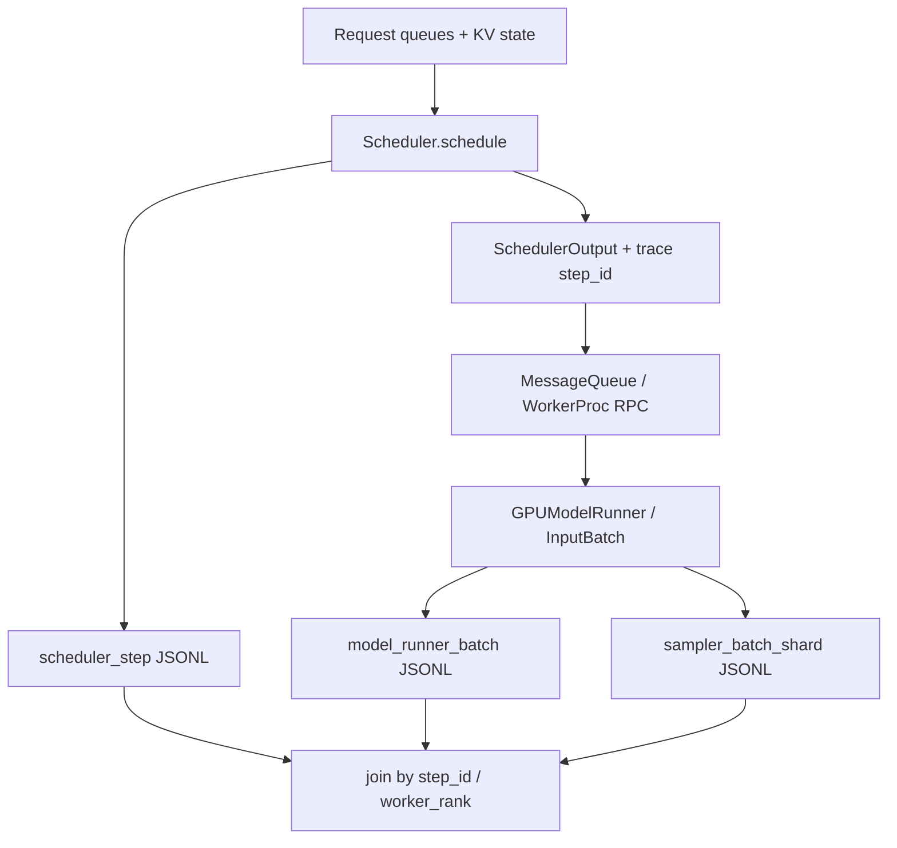

# Scheduler Trace 设计：v0.29 当前路径

当前主实现对应 vLLM v0.29，源码位于个人 fork 分支 [`port/scheduler-trace-v029`](https://github.com/Xiaoda11/vllm/tree/port/scheduler-trace-v029)。v0.26 的原始实验数据与设计仍作为历史基线保留，但当前代码讲解应以 v0.29 为主。

这个 Trace 的目标不是只记录“某个请求很慢”，而是回答三个连续问题：

1. **Scheduler 在某个 step 看到了什么队列与 KV 状态？**
2. **它为什么给每个 request 分配这些 token / block，并发生了哪些 allocation failure 或 preemption？**
3. **这个 SchedulerOutput 最终如何变成 Model Runner 的真实 batch shape？**

## 当前数据流



## 1. Scheduler 侧

核心实现：

- [`trace.py`](https://github.com/Xiaoda11/vllm/blob/port/scheduler-trace-v029/vllm/v1/core/sched/trace.py)
- [`trace_event.py`](https://github.com/Xiaoda11/vllm/blob/port/scheduler-trace-v029/vllm/v1/core/sched/trace_event.py)
- [`scheduler.py`](https://github.com/Xiaoda11/vllm/blob/port/scheduler-trace-v029/vllm/v1/core/sched/scheduler.py)

每个 `scheduler_step` 记录：

- running / waiting / skipped-waiting 的 before / after；
- request 状态和 block table snapshot；
- per-request `num_scheduled_tokens`；
- `token_budget` 与 `input_budget`；
- KV usage、free blocks、request 视角的 allocated/freed block diff；
- prefix cache hit；
- allocation failures；
- preempted / finished request IDs；
- v0.29 KV connector 的同步 load 标记与 offered block state。

这里的 block diff 是**request block mapping 的变化**，不应机械解释成物理 block allocator 的 malloc/free 次数。

### 热路径原则

Trace 默认关闭。开启后，Scheduler 在 `schedule()` 入口做 before snapshot，在原调度逻辑执行期间收集已有 CPU 状态，最后构造 event 并写入后台队列。

实现目标是保持：

```text
trace disabled -> ordinary Scheduler path
trace enabled  -> side-band CPU metadata instrumentation
```

不为了 Trace 去读取 GPU tensor 内容，也不主动增加 CUDA synchronization。

## 2. JSONL writer

`JsonlTraceWriter` 使用：

```text
Scheduler / Worker thread
        ↓ queue.SimpleQueue
background writer thread
        ↓
JSONL file
```

关键设计：

- 环境变量控制，默认关闭；
- schema version 写入 event；
- 独占创建，避免静默覆盖旧证据；
- 后台线程负责 JSON serialization / file flush；
- MRV2 worker 使用 process-local 文件，避免 TP/PP/PCP 多 worker 争用同一个输出文件。

v0.29 MRV2 文件形如：

```text
<trace-stem>.mrv2.pid<PID>.jsonl
```

每条 event 同时记录 vLLM global `worker_rank`，后续可以按 step / worker 语义合并。

## 3. Model Runner 侧

v0.29 将 event construction 拆到 [`model_runner_trace_event.py`](https://github.com/Xiaoda11/vllm/blob/port/scheduler-trace-v029/vllm/v1/core/sched/model_runner_trace_event.py)，调用接入位于 modular GPUModelRunner。

### `model_runner_batch`

记录：

- request IDs；
- persistent rows；
- per-request scheduled tokens；
- worker rank；
- prefill 标记；
- CUDA Graph mode；
- adaptive verification / batch-sharded sampling 状态。

v0.29 最重要的变化是把 token 数拆成三个语义：

```text
scheduler_logical
runner_effective_unpadded
model_input_after_padding
```

它们分别对应 Scheduler 逻辑预算、runner trimming 后实际准备执行的 token 数，以及 CUDA Graph padding 后的 model input shape。三者在 v0.29 已不能默认相等。

### `sampler_batch_shard`

TP batch-sharded sampling 下记录：

- global request / persistent-row layout；
- `persistent_row % tp_size` 得到的 ownership；
- local request shard；
- per-rank request counts；
- per-rank logit split。

这里不读取 GPU-only gather / sort plan tensors。

## 4. Scheduler → Runner correlation

Trace 开启时，SchedulerOutput 附加 step correlation ID。该 ID 随 SchedulerOutput 穿过 vLLM 的 MessageQueue / WorkerProc RPC，并在 worker 侧保存在对应 `InputBatch` 上。

选择 per-InputBatch correlation，而不是 `GPUModelRunner` 上的单个全局 in-flight step slot，是为了避免 overlapping batch / execute-sample pipeline 下 correlation 被后续 batch 覆盖。

CPU CI 已验证该字段穿过真实 MessageQueue serialization 与生产 `WorkerProc._execute_worker_rpc()` dispatch path；完整 engine + real GPU runner 仍是后续 gate。

## 5. 跨层校验思路

v0.26 的简单不变量曾是：

```text
sum(scheduler.num_scheduled_tokens)
  == model_runner_batch.num_tokens
```

v0.29 不能再无条件沿用，因为 adaptive verification 与 CUDA Graph padding 会改变 runner / model shape。

当前应按三层语义解释：

```text
Scheduler decision
  -> scheduler_logical
CPU-visible runner trimming
  -> runner_effective_unpadded
CUDA Graph padding
  -> model_input_after_padding
```

因此 Trace 的作用从“验证两个数字相等”升级为“解释数字在哪一层发生变化，以及变化是不是执行层机制而非 Scheduler 决策”。

## 6. 设计边界

- Trace 默认关闭；开启时仍有 Python event construction、serialization 和后台写盘成本；
- 当前没有 v0.29 GPU overhead 结论；
- process-local MRV2 文件和 TP shard 语义已有 CPU contract test，但未完成真实 multi-GPU end-to-end 验证；
- mock KV connector 能验证 Scheduler integration contract，不代表真实网络 KV transfer；
- PCP 当前保留 correlation ID，但 pre-partition 与 PCP-local execution shape 仍需进一步专用事件；
- v0.26 waiting-bypass / fairness policy 与 v0.29 Trace port 是两条相关但独立的工程线，不应混成同一个“已合入策略”。

完整迁移状态与测试边界见 [`v029_migration.md`](v029_migration.md)。历史 v0.26 实验与旧版跨层 Trace 可从仓库结果、样例和 `REPRODUCING.md` 继续复现。
